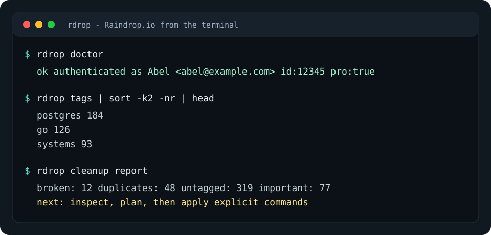

# raindrop-cli

[](https://github.com/KingPsychopath/raindrop-cli/actions/workflows/ci.yml)
[](https://github.com/KingPsychopath/raindrop-cli/actions/workflows/release.yml)
[](LICENSE)
[](https://goreportcard.com/report/github.com/KingPsychopath/raindrop-cli)

`rdrop` is a small Go CLI for managing large [Raindrop.io](https://raindrop.io) bookmark libraries from the terminal.

It is built for people and scripts: tab-separated output by default, JSON when you ask for it, exports written directly to stdout, and explicit guardrails around bulk destructive actions.



## Highlights

- Dependency-light Go binary with no runtime services.
- First-class commands for bookmarks, collections, tags, highlights, backups, sharing, imports, exports, filters, and cleanup reports.
- Pipeline-friendly output for shell tools like `cut`, `sort`, `awk`, and `jq`.
- `--json` on commands where structured output is useful.
- `rdrop raw` escape hatch for documented REST endpoints that do not yet have a first-class command.
- Tag and cleanup reports designed for cautious large-library organization.

## Install

Download a prebuilt binary from [GitHub Releases](https://github.com/KingPsychopath/raindrop-cli/releases). Release archives include Linux, macOS, and Windows builds for amd64 and arm64, plus SHA-256 checksums.

In Go release names, macOS builds are often labeled `darwin`: `darwin_amd64` is Intel Mac, and `darwin_arm64` is Apple Silicon Mac.

Install a Linux or macOS archive:

```bash
curl -LO https://github.com/KingPsychopath/raindrop-cli/releases/download/v0.1.0/rdrop_0.1.0_linux_amd64.tar.gz
tar -xzf rdrop_0.1.0_linux_amd64.tar.gz
sudo install -m 0755 rdrop_0.1.0_linux_amd64/rdrop /usr/local/bin/rdrop
rdrop version
```

Install a Windows archive from PowerShell:

```powershell
Invoke-WebRequest https://github.com/KingPsychopath/raindrop-cli/releases/download/v0.1.0/rdrop_0.1.0_windows_amd64.zip -OutFile rdrop.zip
Expand-Archive .\rdrop.zip -DestinationPath .
.\rdrop_0.1.0_windows_amd64\rdrop.exe version
```

Verify checksums:

```bash
curl -LO https://github.com/KingPsychopath/raindrop-cli/releases/download/v0.1.0/checksums.txt
shasum -a 256 -c checksums.txt --ignore-missing
```

Or install from source with Go 1.22 or newer:

```bash
go install github.com/KingPsychopath/raindrop-cli/cmd/rdrop@latest
```

Install with Homebrew:

```bash
brew tap KingPsychopath/tap
brew install rdrop
```

To build from a local checkout:

```bash
make build
./bin/rdrop version
```

## Authentication

Create a Raindrop.io API token, then set it in your shell:

```bash
export RAINDROP_TOKEN=your_token_here
rdrop doctor
```

`rdrop doctor` verifies that the token works and prints the authenticated account.

You can also store the token in:

```text
~/.config/openclaw/gateway.env
```

with:

```text
RAINDROP_TOKEN=your_token_here
```

Optional API overrides:

```bash
export RAINDROP_API_BASE_URL=https://api.raindrop.io/rest/v1
export RAINDROP_MCP_ENDPOINT=https://api.raindrop.io/rest/v2/ai/mcp
```

## Quick Start

List collections:

```bash
rdrop collections
```

Search bookmarks:

```bash
rdrop search "postgres"
```

Add a bookmark:

```bash
rdrop add https://example.com --title Example --tags docs,example --parse
```

Export to CSV:

```bash
rdrop export --format csv > raindrop.csv
```

Use JSON with `jq`:

```bash
rdrop list --search "postgres" --json | jq '.items[].link'
```

Install shell completion:

```bash
rdrop completion bash > ~/.local/share/bash-completion/completions/rdrop
mkdir -p ~/.zfunc && rdrop completion zsh > ~/.zfunc/_rdrop
rdrop completion fish > ~/.config/fish/completions/rdrop.fish
```

For zsh, add `fpath=(~/.zfunc $fpath)` to your shell config if `~/.zfunc` is not already in `fpath`.

## Everyday Workflows

Find things that need attention:

```bash
rdrop filters
rdrop untagged
rdrop duplicates
rdrop broken
```

Start a safe cleanup pass:

```bash
rdrop cleanup report --json > cleanup-report.json
rdrop cleanup report
```

Inspect candidates before mutating anything:

```bash
rdrop untagged --json | jq '.items[] | {id: ._id, title, link}'
rdrop duplicates --json | jq '.items[] | {id: ._id, title, link}'
rdrop broken --json | jq '.items[] | {id: ._id, title, link}'
```

Apply explicit changes:

```bash
rdrop tag merge "Machine Learning,machine learning" machine-learning
rdrop batch tag --ids 101,102 --tags needs-review
rdrop batch move --ids 101,102 --to 98765
```

Plan a bulk delete before applying it:

```bash
rdrop batch delete --search "notag:true" --dry-run
rdrop batch delete --search "notag:true" --yes
```

## Command Reference

Run:

```bash
rdrop help
rdrop help cleanup
rdrop help batch
```

Common commands:

```text
rdrop doctor
rdrop me [--json]
rdrop stats [--json]
rdrop collections [--children] [--json]
rdrop collection create [--parent id] <title>
rdrop collection update <id> '{"title":"New name"}'
rdrop collection merge --to 123 --ids 456,789
rdrop collection empty-trash --yes
rdrop tags [--collection id] [--json]
rdrop tag rename old-name new-name
rdrop tag merge old-name,old-name-2 new-name
rdrop list [--collection id] [--search query] [--page n] [--per-page n] [--json]
rdrop search "javascript"
rdrop get [--json] <id>
rdrop add [--title text] [--tags a,b] [--collection id] [--parse] <url>
rdrop update <id> '{"important":true,"tags":["go","docs"]}'
rdrop delete <id>
rdrop batch tag --ids 1,2 --tags go,docs
rdrop batch move --ids 1,2 --to 98765
rdrop batch delete --ids 1,2 --dry-run
rdrop export --format csv|html|zip > bookmarks.csv
rdrop import file bookmarks.html
rdrop highlights [--collection id]
rdrop backups
rdrop backup download <backup-id> --format csv > backup.csv
rdrop raw GET user/stats
```

For endpoint coverage, see [docs/API_COVERAGE.md](docs/API_COVERAGE.md). For cleanup guidance, see [docs/ORGANIZING.md](docs/ORGANIZING.md). For packaging notes, see [docs/PACKAGING.md](docs/PACKAGING.md). For future ideas with no expected timing, see [docs/ROADMAP.md](docs/ROADMAP.md).

## Output Contract

Human-readable list output is tab-separated and intentionally compact:

```bash
rdrop search "postgres" | cut -f1,3
rdrop tags | sort -k2 -nr | head
```

Structured output is pretty-printed JSON:

```bash
rdrop collections --json
rdrop cleanup report --json
```

Commands that export file formats write bytes directly to stdout:

```bash
rdrop export --format html > raindrop.html
rdrop backup download 659d42a35ffbb2eb5ae1cb86 --format csv > backup.csv
```

## Safety Model

`rdrop` keeps destructive operations explicit:

- `cleanup report` never mutates your library.
- Bulk tag and move require explicit `--ids`.
- Bulk delete requires either `--dry-run` or `--yes`.
- Emptying Trash requires `--yes`.
- Exports and backups write to stdout so you choose where bytes go.

Prefer this sequence for large organizing work:

```bash
rdrop cleanup report --json
rdrop untagged --json
rdrop batch tag --ids 1,2,3 --tags needs-review
rdrop cleanup report --json
```

## Development

```bash
git clone https://github.com/KingPsychopath/raindrop-cli.git
cd raindrop-cli
make check
```

Useful targets:

```text
make build    build ./bin/rdrop
make test     run tests
make vet      run go vet
make check    format, tidy, vet, test, and build
make assets   regenerate README/demo assets
make clean    remove build artifacts
```

The project intentionally prefers the Go standard library. Add dependencies only when they clearly improve maintainability.

The terminal demo image is generated from [scripts/render-terminal-demo.go](scripts/render-terminal-demo.go):

```bash
make assets
```

## Releases

Releases are created by pushing a semantic version tag:

```bash
git tag v0.1.0
git push origin v0.1.0
```

GitHub Actions builds release archives for:

- macOS amd64 and arm64, using Go's `darwin` build target
- Linux amd64 and arm64
- Windows amd64 and arm64

Each release includes `checksums.txt`.

The release workflow cross-compiles from GitHub Actions. That is a normal fit for a small Go CLI. The macOS binaries are not currently signed or notarized.

Release builds inject version metadata so `rdrop version` reports the release version, commit, and build date.

## License

MIT. See [LICENSE](LICENSE).
